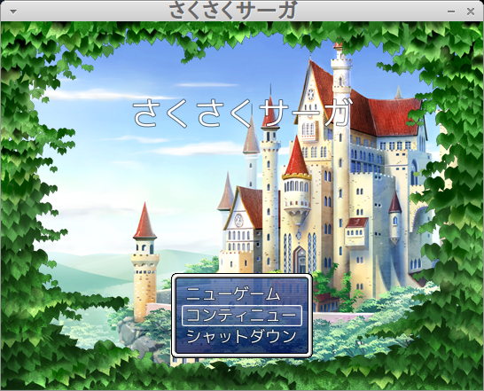
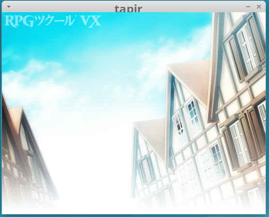
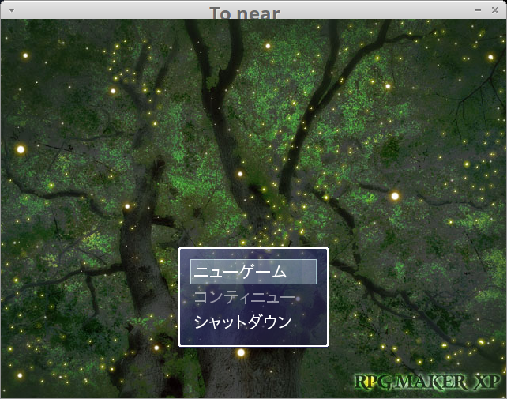
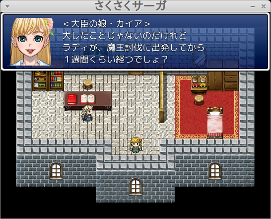
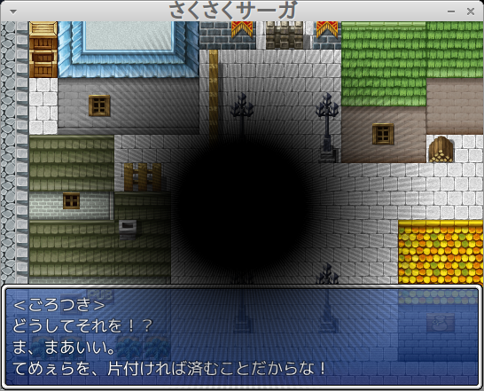
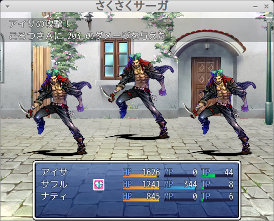
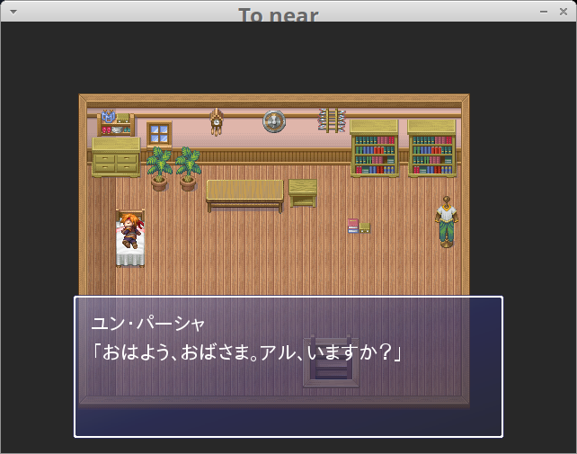

# Tapir





Tapir is a re-implementation project of RGSS/RGSS2/RGSS3 game runtimes. In other words, Tapir aims to run RPG Maker XP/VX/VX Ace games on Linux (and other platforms).

(日本語版READMEもあります。README.ja.mdを参照してください。)

# How to build

Following is the instruction for Ubuntu 16.04. It may also work on another platforms.

```
$ sudo apt install build-essential autoconf automake bison flex libsdl2-dev libsdl2-image-dev libsdl2-mixer-dev libsdl2-ttf-dev libfontconfig1-dev libconfig-dev
$ ./autogen.sh
$ ./configure
$ make
$ sudo make install
```

# Install RTPs

There are two ways to install RTP.

## Installation using Windows or Wine

In Windows, RTPs will be installed to these directories by default:

- `C:\Program Files (x86)\Common Files\Enterbrain\RGSS\Standard`
- `C:\Program Files (x86)\Common Files\Enterbrain\RGSS2\RPGVX`
- `C:\Program Files (x86)\Common Files\Enterbrain\RGSS3\RPGVXAce`

(In 32bit windows, `Program Files (x86)` becomes `Program Files`.)

Tapir currently looks for them in these directories:

- `/usr/local/share/Enterbrain/RGSS/Standard`
- `/usr/local/share/Enterbrain/RGSS2/RPGVX`
- `/usr/local/share/Enterbrain/RGSS3/RPGVXAce`

## Installation using scripts

You can even install RTPs without Windows or Wine.

Use the script at your own risk.

```
$ sudo apt install innoextract
$ cd rtp
$ ./install1.sh
$ ./install2.sh
$ ./install3.sh
```

# Run tapir

Tapir looks for the current directory by default. You can change this by using `-d` option.

```
% tapir -h
Tapir: RGSS (RPG Maker XP, VX and VX Ace) compatible game engine

Usage: ./tapir [-h] [-d DIR] [-1] [-2] [-3] [test] [btest] [console]
    -h      show this help
    -d DIR  move to DIR before running the game
    -1      force RGSS version 1 (RPG Maker XP)
    -2      force RGSS version 2 (RPG Maker VX)
    -3      force RGSS version 3 (RPG Maker VX Ace)
    test    enable test mode
    btest   enable battle test mode
    console show console (not yet implemented)
```

# Configuring tapir

Tapir reads configuration from `/etc/tapir.cfg` and `$HOME/.tapir.cfg`. This is in the `libconfig` format.

Below is an example configuration file:

```
# Put version-agnostic configs here
rgss:
{
  button1 = "A";
  button2 = "B";
  button3 = "C";
  button4 = "X";
  button5 = "Y";
  button6 = "Z";
  button7 = "L";
  button8 = "R";
  button9 = "";
  button10 = "";
  space = "C";
  enter = "C";
  esc = "B";
  num0 = "B";
  shift = "A";
  key_x = "B";
  key_v = "";
  key_b = "";
  key_a = "X";
  key_s = "Y";
  key_d = "Z";
  key_q = "L";
  key_w = "R";
};

# Put version-specific configs here
rgss1:
{
  key_z = "A";
  key_c = "C";
}

rgss2:
{
  key_z = "C";
  key_c = "";
}

rgss3:
{
  key_z = "C";
  key_c = "";
};
```

# Extracting a game archive

Often a game is provided in a self-extracting form (i.e. `*.exe`).

If the archive was packed by RPG Maker, it can be extracted by cabextract.

```
$ sudo apt install cabextract
$ cabextract -dSakusaku Sakusaku.exe
(it will extract the game to Sakusaku/ directory.)
```
